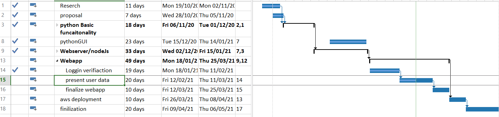

# **PROJECT JOURNAL - Emmett Cowan**
----------------------------------------------------------------------

## **Date**
-	Week 21 (22nd Feb – 28th Feb)

## **Tasks**
-   continue adding userdata for display on dasdhboard
-   update and layout userpage
-   update CSS and website style to be responsive with Bootstrap

## **Reflection**
-   learned alot about how bootstrap works and how to implemnt it in a proejct

## **Timeline**

## **reserch**
-   Chart Js
-   MongoDB
-   [Bootstrap](https://getbootstrap.com/docs/5.0/getting-started/introduction/)

## **_Issues:_**
-	laying out a login form 

### **Software:**

## **_Solutions_**
-	used a bootstrap template and editied it for my needs
-   refrence https://getbootstrap.com/docs/5.0/examples/sign-in/
	